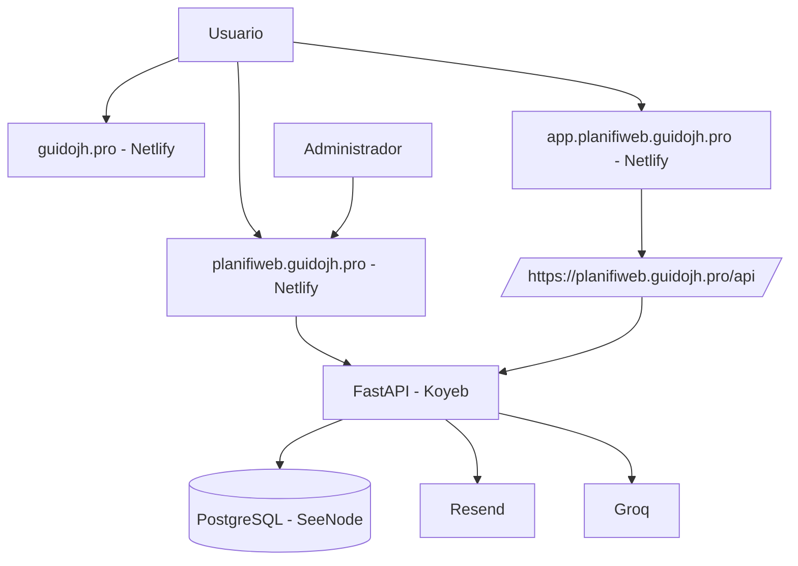

# PLANIFIWEB - Documentacion tecnica y operativa

## 1. Objetivo del repositorio

Este repositorio concentra el sitio publico y la capa operativa principal de PLANIFIWEB.

Su alcance actual es:
- hub principal de marca en `guidojh.pro`
- gateway comercial y de cuenta en `planifiweb.guidojh.pro`
- backend FastAPI publicado en Koyeb
- scripts de despliegue y smoke tests

La app curricular real vive en un repositorio separado llamado `PLANIFIWEB` y se publica en `app.planifiweb.guidojh.pro`.

## 2. Arquitectura productiva actual



### Estado real de infraestructura

| Capa | Estado | Observacion |
|---|---|---|
| Hub | Activo | Netlify |
| Gateway | Activo | Netlify + Next.js |
| App | Activa | Netlify + Vite |
| API | Activa | Koyeb |
| DB | Activa | PostgreSQL en SeeNode |
| Correo | Activo | Resend con fallback temporal |
| Vercel | Retirado | No operativo |
| SeeNode Web Apps | Retiradas | No deben recrearse |

## 3. Responsabilidades por superficie

### 3.1 Hub `guidojh.pro`
Responsable de:
- presencia principal de Guido JH
- redes sociales
- proyectos personales
- enlace canónico hacia PLANIFIWEB

### 3.2 Gateway `planifiweb.guidojh.pro`
Responsable de:
- landing comercial
- login y registro
- dashboard de cuenta
- suscripcion y checkout Yape
- panel admin
- aceptacion legal
- cambio y recuperacion de contraseña
- proxy `/api/*` al backend
- SEO publico de PLANIFIWEB

### 3.3 App `app.planifiweb.guidojh.pro`
Responsable de:
- experiencia autenticada del producto curricular
- generadores y documentos
- configuracion funcional del usuario

No gestiona contraseñas localmente. Esa responsabilidad se delega al gateway.

## 4. Flujos funcionales principales

### 4.1 Registro y activacion
1. El docente entra al gateway.
2. Crea cuenta o inicia sesion.
3. Acepta terminos y politica si corresponde.
4. Elige plan.
5. Sube comprobante Yape.
6. El admin revisa el pago.
7. Si la cuenta queda activa, puede entrar a la app.

### 4.2 Login
- si el correo no existe: `404` `Correo no registrado`
- si la contraseña no coincide: `401` `Contraseña incorrecta`
- si las credenciales son correctas: sesion por cookie + token de respuesta

### 4.3 Cambio de contraseña
Disponible en el dashboard del gateway, seccion `Seguridad`.

Requisitos:
- sesion activa
- contraseña actual correcta
- nueva contraseña distinta a la actual
- confirmacion obligatoria
- CSRF valido

Endpoint:
- `POST /api/auth/change-password`

### 4.4 Recuperacion de contraseña
Rutas publicas:
- `/recuperar-acceso`
- `/restablecer-contrasena`

Endpoints:
- `POST /api/auth/forgot-password`
- `POST /api/auth/reset-password`

Reglas implementadas:
- token de un solo uso
- token almacenado solo como hash
- TTL configurable
- token expirado o ya usado => rechazo
- reseteo invalida tokens pendientes del mismo usuario
- la sesion no se inicia automaticamente al finalizar el reset

## 5. Seguridad implementada

### 5.1 Sesion y cookies
- cookie `HttpOnly`
- `SameSite=Lax`
- `Secure=true` en produccion
- dominio de cookie host-only

### 5.2 CSRF
- doble envio de token
- endpoint dedicado `GET /api/auth/csrf`
- obligatorio en operaciones mutantes del gateway

### 5.3 Politicas de acceso
- CORS restringido a:
  - `https://planifiweb.guidojh.pro`
  - `https://app.planifiweb.guidojh.pro`
- `TrustedHostMiddleware`
- docs de FastAPI desactivadas en produccion

### 5.4 Descubrimiento e indexacion
- el gateway es indexable solo en sus rutas publicas
- la app autenticada es `noindex`
- el sistema publica:
  - `robots.txt`
  - `sitemap.xml`
  - `llms.txt`

### 5.5 Correo de recuperacion
Proveedor: Resend.

Configuracion objetivo:
- remitente oficial: `noreply@guidojh.pro`

Estado actual:
- si `guidojh.pro` no esta verificado en Resend, el backend usa fallback a `onboarding@resend.dev`
- el contenido del correo sigue siendo de PLANIFIWEB
- cuando el dominio quede verificado, el fallback deja de ser necesario

## 6. Planes y pagos

### 6.1 Catalogo activo
| Plan | Precio | Limite diario | Uso esperado |
|---|---|---:|---|
| Start | `S/9` | `20` | Inicio ordenado |
| Pro | `S/19` | `60` | Trabajo continuo |
| Institucional | `S/39` | `200` | Uso intensivo |

### 6.2 Metodo de pago
- Yape como metodo visible actual
- revision administrativa para activacion final
- validacion auxiliar del comprobante segun configuracion disponible

### 6.3 Datos operativos de Yape
- destino esperado: `Guido Jar*`
- ultimos 3 del celular: `929`
- tolerancia configurada de monto: `0.01`

## 7. Variables de entorno por componente

## 7.1 Gateway `frontend`

```bash
NEXT_PUBLIC_API_URL=/api
NEXT_PUBLIC_SITE_URL=https://planifiweb.guidojh.pro
NEXT_PUBLIC_APP_URL=https://app.planifiweb.guidojh.pro
NEXT_PUBLIC_ALLOWED_EMAIL_DOMAINS=
API_PROXY_TARGET=https://planifiweb-platform-guidojh-de66ea4f.koyeb.app
```

## 7.2 Backend `backend`

```bash
APP_ENV=production
SECRET_KEY=<secreto>
DATABASE_URL=<postgresql activo>
PUBLIC_APP_URL=https://planifiweb.guidojh.pro
CORS_ORIGINS=https://planifiweb.guidojh.pro,https://app.planifiweb.guidojh.pro
TRUSTED_HOSTS=planifiweb.guidojh.pro,*.koyeb.app
SESSION_COOKIE_NAME=planifiweb_session
SESSION_COOKIE_SECURE=true
SESSION_COOKIE_SAMESITE=lax
SESSION_COOKIE_DOMAIN=
API_DOCS_ENABLED=false
PAYMENT_PRECHECK_ENABLED=false
GROQ_API_KEY=<token>
GROQ_MODEL=llama-3.1-8b-instant
RESEND_API_KEY=<token>
RESEND_FROM_EMAIL=noreply@guidojh.pro
RESEND_FROM_NAME=PLANIFIWEB
PASSWORD_RESET_TOKEN_TTL_MINUTES=60
PASSWORD_RESET_URL_BASE=https://planifiweb.guidojh.pro/restablecer-contrasena
```

## 7.3 App `PLANIFIWEB`

```bash
VITE_API_BASE_URL=https://planifiweb.guidojh.pro/api
VITE_APP_PUBLIC_URL=https://app.planifiweb.guidojh.pro
```

## 8. Despliegue y operacion

### 8.1 Netlify
Sites esperados:
- `guidojh-root`
- `planifiweb-gateway`
- `planifiweb-app`

Dominios esperados:
- `guidojh.pro`
- `www.guidojh.pro`
- `planifiweb.guidojh.pro`
- `app.planifiweb.guidojh.pro`

### 8.2 Koyeb
Servicio productivo:
- app: `planifiweb-platform`
- service: `planifiweb-api`
- URL actual: `https://planifiweb-platform-guidojh-de66ea4f.koyeb.app`

Run command:

```bash
alembic upgrade head && uvicorn app.main:app --host 0.0.0.0 --port $PORT
```

Checks:
- `/health`
- `/ready`

### 8.3 SeeNode
Rol actual:
- fuente activa de la base PostgreSQL productiva

Rol retirado:
- no debe hospedar apps web de FastAPI
- las apps web antiguas ya fueron eliminadas

### 8.4 Vercel
Estado:
- retirado de la operacion
- documentacion mantenida solo como referencia historica

## 9. Calidad y pruebas

### 9.1 Backend

```powershell
cd backend
venv\Scripts\python.exe -m pytest tests -q
```

Cobertura funcional minima actual:
- login y registro
- mensajes de login
- cambio de contraseña
- recuperacion de contraseña
- infraestructura fallback

### 9.2 Gateway

```powershell
cd frontend
npm run lint
npm run typecheck
npm run build
```

### 9.3 App

```powershell
cd ..\PLANIFIWEB
npm run build
```

### 9.4 Smoke operativo recomendado
- `GET /health`
- `GET /ready`
- `GET /api/auth/me`
- login real
- solicitud de recuperacion
- reset por enlace
- cambio de contraseña autenticado
- entrada a la app

## 10. Deuda tecnica y pendientes conocidos

### 10.1 Resend
Pendiente:
- verificar `guidojh.pro` en Resend para dejar de depender de `onboarding@resend.dev`

### 10.2 Base de datos
Pendiente:
- si se decide salir completamente de SeeNode, migrar la base activa y reconfigurar `DATABASE_URL` en Koyeb

### 10.3 Secretos
Pendiente obligatorio:
- rotar cualquier token compartido en chats o archivos locales temporales

## 11. Archivos de referencia
- [README.md](README.md)
- [frontend/README.md](frontend/README.md)
- [deploy/netlify/README.md](deploy/netlify/README.md)
- [deploy/koyeb/README.md](deploy/koyeb/README.md)
- [deploy/seenode/README.md](deploy/seenode/README.md)
- [deploy/vercel/README.md](deploy/vercel/README.md)
