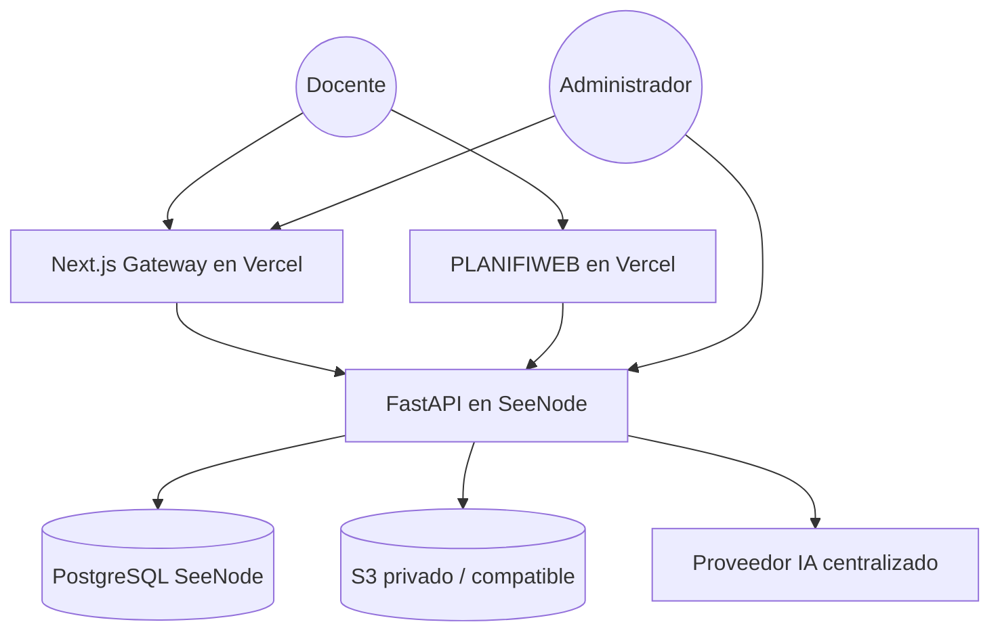

# PLANIFIWEB Platform - Documentacion Tecnica

Documentacion técnica de la plataforma integrada con foco en un despliegue de servicio profesional.

## 1. Alcance del sistema

La plataforma se compone de tres piezas bajo un mismo dominio:

- `/` y `/dashboard`: landing, autenticación, suscripción, documentos legales y panel admin en Next.js.
- `/api/*`: backend FastAPI con autenticación, pagos, administración, control de uso y proxy de IA.
- `/app/*`: aplicación `PLANIFIWEB` servida como SPA de React/Vite.

El objetivo operativo es que el docente no salga del flujo comercial principal y entre a la app productiva solo cuando su cuenta y su estado de licencia lo permiten.

## 2. Arquitectura de alto nivel

## 3. Principios operativos

- Un solo dominio y una sola sesión.
- Autenticación segura por cookie `HttpOnly`.
- Sin `localStorage` para sesión sensible.
- Soporte visible y directo por Telegram.
- Comprobantes privados y auditables.
- Términos y Privacidad visibles, versionados y exigidos.
- IA centralizada en backend para evitar exponer credenciales al navegador.
- Acceso gradual según estado de suscripción.

## 4. Estados de suscripción

- `awaiting_payment`: cuenta creada pero sin comprobante.
- `pending_review`: comprobante recibido y en revisión.
- `active`: suscripción aprobada y acceso habilitado.
- `rejected`: pago rechazado.
- `expired`: licencia vencida.
- `suspended`: acceso suspendido por decisión operativa o administrativa.

## 5. Política de acceso y monetización

| Estado | Acceso a `/app` | Límite IA diario | Exportación |
|---|---:|---:|---:|
| `awaiting_payment` | No | 0 | No |
| `pending_review` | Sí | 3 | No |
| `active` | Sí | 20 | Sí |
| `rejected` / `expired` / `suspended` | No | 0 | No |

La lógica de negocio de sesión se resuelve desde `GET /api/auth/me` y se refleja tanto en la landing como en `PLANIFIWEB`.

## 6. Seguridad implementada

### 6.1 Autenticación y sesión
- JWT firmado en backend.
- Entrega por cookie de sesión `HttpOnly`.
- Lectura de sesión desde backend, no desde almacenamiento local del navegador.
- `logout` explícito por endpoint.
- Validación de usuario actual y admin por dependencias FastAPI.

### 6.2 Protección de origen y cabeceras
- `TrustedHostMiddleware` para hosts autorizados.
- CORS explícito, sin wildcard en producción.
- Headers de endurecimiento: `X-Frame-Options`, `X-Content-Type-Options`, `Referrer-Policy`, `Permissions-Policy`, `Cross-Origin-Opener-Policy`, `Cross-Origin-Resource-Policy`.
- `Strict-Transport-Security` previsto para producción bajo HTTPS.
- Verificación de `Origin` / `Referer` en operaciones state-changing basadas en cookie.

### 6.3 Superficie de documentación técnica
- `/docs`, `/redoc` y `/openapi.json` quedan controlados por `API_DOCS_ENABLED`.
- Deben ir desactivados en producción pública.

### 6.4 Rate limiting
Se añadió limitación aplicativo para:
- registro
- login
- subida de comprobantes
- revisión admin
- endpoints de IA

Para un entorno de tráfico real, se recomienda complementar con rate limiting y WAF en el reverse proxy o CDN.
Cuando `REDIS_URL` está configurado, la plataforma usa Redis como backend distribuido para estos límites.

### 6.5 Comprobantes
- Los archivos ya no se montan como recursos públicos.
- Se resuelven por endpoint autenticado o URL presignada S3.
- Admin y propietario pueden consultarlos según permisos.

## 7. Cumplimiento legal y comunicación al usuario

### 7.1 Documentos visibles
La plataforma expone enlaces visibles a:
- `Términos y Condiciones`
- `Política de Privacidad`

Se muestran en:
- navbar
- footer
- formularios de registro
- panel de cuenta
- modal de suscripción
- app protegida

### 7.2 Aceptación obligatoria
El registro exige aceptación de ambos documentos.
Además, la aceptación queda versionada en base de datos para futuras renovaciones legales.

### 7.3 Cookies
No se implementó banner de cookies porque el servicio usa únicamente cookies esenciales para autenticación, continuidad de sesión y seguridad. No se usan cookies publicitarias ni analíticas de terceros.

### 7.4 Soporte
Se añadió soporte visible por Telegram hacia `@guidojh`:
- botón flotante global
- enlaces en footer
- enlace dentro de la app protegida

## 8. Flujo funcional completo

1. El docente entra a la landing.
2. Crea su cuenta o inicia sesión.
3. Acepta los documentos legales vigentes.
4. Selecciona el plan principal.
5. Sube el comprobante de pago por Yape.
6. El backend registra el pago con estado `pending`.
7. El usuario entra a su dashboard y ve el estado real de la cuenta.
8. El administrador revisa y aprueba o rechaza desde `/admin`.
9. Si la cuenta queda activa, el usuario entra a `/app/dashboard` con la misma sesión.

## 9. Backend

### 9.1 Stack
- FastAPI
- SQLModel
- Alembic
- `python-jose`
- `passlib`
- `httpx`
- `boto3`
- `pydantic-settings`

### 9.2 Endpoints relevantes

#### Auth
- `POST /api/auth/register`
- `POST /api/auth/login`
- `POST /api/auth/logout`
- `GET /api/auth/me`
- `POST /api/auth/legal-acceptance`

#### Suscripción y uso
- `GET /api/subscription/status`
- `GET /api/usage/me`

#### Pagos
- `POST /api/payments/upload-proof`
- `GET /api/payments/history`
- `GET /api/payments/{payment_id}/receipt`

#### IA
- `POST /api/ai/generate`
- `POST /api/ai/generate-json`

#### Admin
- `GET /api/admin/payments`
- `PATCH /api/admin/payments/{payment_id}`

### 9.3 Contrato de sesión
La respuesta de sesión incluye:
- `user`
- `subscription_status`
- `subscription_scope`
- `active_plan`
- `daily_limit`
- `daily_used`
- `exports_enabled`
- `can_access_app`
- `legal`

## 10. Landing / Gateway Next.js

Responsabilidades:
- captar y convertir
- registrar e iniciar sesión
- mantener el flujo de suscripción sin bucles
- mostrar estado real de licencia
- exigir aceptación legal cuando haga falta
- ofrecer panel admin y soporte visible

## 11. PLANIFIWEB

Cambios aplicados:
- `basename="/app"`.
- mismo origen para `/api`.
- sesión basada en backend y cookie segura.
- eliminación del modelo anterior basado en `localStorage` para credenciales de acceso.
- eliminación de configuración de proveedor/modelo/api key del usuario final.
- soporte visible y enlaces legales en la app.

## 12. Variables de entorno

### Backend
- `APP_ENV`
- `SECRET_KEY`
- `DATABASE_URL`
- `REDIS_URL`
- `ALLOWED_EMAIL_DOMAINS`
- `CORS_ORIGINS`
- `TRUSTED_HOSTS`
- `API_DOCS_ENABLED`
- `ACCESS_TOKEN_EXPIRE_MINUTES`
- `SESSION_COOKIE_NAME`
- `SESSION_COOKIE_SECURE`
- `SESSION_COOKIE_SAMESITE`
- `SESSION_COOKIE_DOMAIN`
- `MAX_RECEIPT_FILE_MB`
- `ALLOWED_RECEIPT_CONTENT_TYPES`
- `LOCAL_UPLOAD_DIR`
- `RECEIPT_URL_TTL_SECONDS`
- `S3_ENDPOINT_URL`
- `S3_REGION`
- `S3_BUCKET`
- `S3_ACCESS_KEY_ID`
- `S3_SECRET_ACCESS_KEY`
- `S3_PUBLIC_BASE_URL`
- `AI_PROVIDER`
- `AI_PROVIDER_CHAIN`
- `AI_TIMEOUT_SECONDS`
- `AI_MODEL`
- `AI_API_KEY`
- `AI_BASE_URL`
- `GROQ_*`
- `OPENROUTER_*`
- `PUBLIC_APP_URL`
- `LEGAL_TERMS_VERSION`
- `LEGAL_PRIVACY_VERSION`

### Landing / Gateway
- `NEXT_PUBLIC_API_URL`
- `NEXT_PUBLIC_SITE_URL`
- `NEXT_PUBLIC_ALLOWED_EMAIL_DOMAINS`
- `API_PROXY_TARGET`
- `APP_PROXY_TARGET`

### PLANIFIWEB
- `VITE_API_BASE_URL`
- `VITE_APP_PUBLIC_URL`

## 13. Despliegue recomendado

### Staging estable
- Gateway Next.js en Vercel
- FastAPI en SeeNode
- `PLANIFIWEB` en Vercel como proyecto separado
- PostgreSQL real
- Redis real
- bucket privado para comprobantes

### Operación del gateway
- `/api/*` se resuelve por rewrite del proyecto Next.js hacia SeeNode
- `/app/*` se resuelve por rewrite del proyecto Next.js hacia el proyecto Vercel de `PLANIFIWEB`

### Archivo de referencia
- Guía Vercel/SeeNode: [deploy/vercel/README.md](deploy/vercel/README.md)
- Alternativa Nginx clásica: [deploy/nginx/planifiweb.production.conf](deploy/nginx/planifiweb.production.conf)

## 14. CI y quality gate

El pipeline debe validar:
- tests backend
- lint + typecheck + build de la landing

## 15. Pruebas validadas en esta iteración

- Backend: `pytest tests -q` -> `20 passed`
- Landing: `npm run lint` -> OK
- Landing: `npm run typecheck` -> OK
- Landing: `npm run build` -> OK

## 16. Riesgo residual importante

La restricción de exportación en `PLANIFIWEB` sigue dependiendo de la aplicación cliente porque los documentos se editan y renderizan allí. El endurecimiento de sesión ya impide acceso directo no autorizado al flujo protegido, pero para un enforcement irrefutable de exportación es necesario mover la generación final de PDF/DOCX a un servicio server-side dedicado.

No lo oculto: esa es la brecha técnica principal que todavía merece una segunda iteración si el objetivo es control total estilo DRM.
