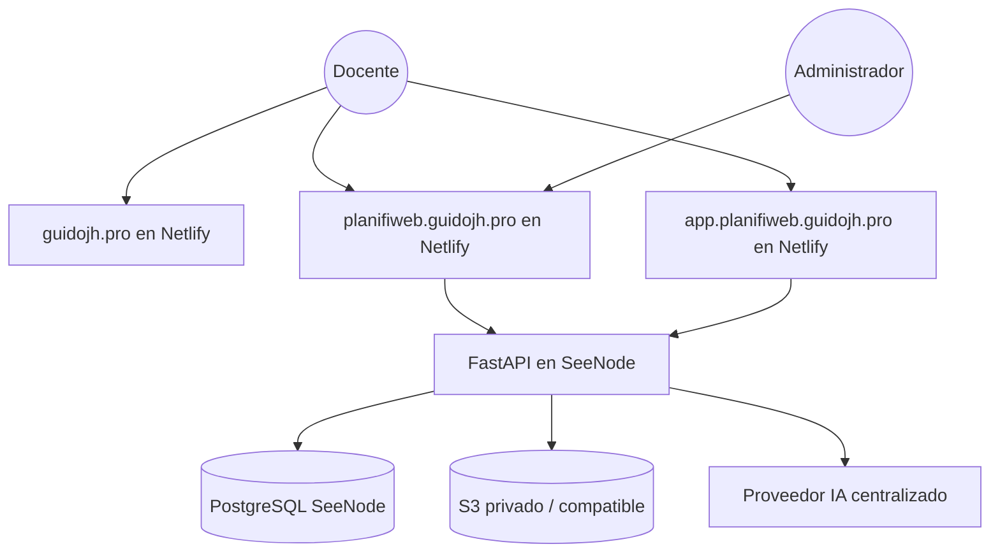

# PLANIFIWEB Platform - Documentación técnica

## 1. Alcance

La plataforma queda dividida en tres superficies:

- `https://guidojh.pro` -> hub principal
- `https://planifiweb.guidojh.pro` -> gateway comercial y operativo
- `https://app.planifiweb.guidojh.pro` -> app real de `PLANIFIWEB`

El backend FastAPI permanece en SeeNode y se expone públicamente solo a través de `https://planifiweb.guidojh.pro/api/*`.

## 2. Arquitectura de alto nivel



## 3. Principios operativos

- El gateway es la única superficie pública indexable de PLANIFIWEB.
- La app real vive en subdominio propio y queda `noindex`.
- La sesión sigue centrada en el gateway.
- La app consume la API del gateway por URL absoluta.
- No se usan credenciales sensibles en `localStorage`.

## 4. Flujo operativo

1. El usuario entra a `planifiweb.guidojh.pro`.
2. Crea cuenta o inicia sesión.
3. Acepta documentos legales.
4. Elige plan y paga por Yape.
5. Sube comprobante.
6. Admin revisa el pago en `/admin`.
7. Si queda activo, entra a `https://app.planifiweb.guidojh.pro/dashboard`.

## 5. Seguridad implementada

- Cookie de sesión `HttpOnly`.
- CSRF real con doble envío.
- CORS explícito para:
  - `https://planifiweb.guidojh.pro`
  - `https://app.planifiweb.guidojh.pro`
- `TrustedHostMiddleware`.
- `Swagger/OpenAPI` desactivable por entorno.
- Headers de seguridad en gateway y hub.
- `X-Robots-Tag` de no indexación para la app.

## 6. Variables relevantes

### Backend

- `PUBLIC_APP_URL=https://planifiweb.guidojh.pro`
- `CORS_ORIGINS=https://planifiweb.guidojh.pro,https://app.planifiweb.guidojh.pro`
- `SESSION_COOKIE_DOMAIN=`

### Gateway

- `NEXT_PUBLIC_API_URL=/api`
- `NEXT_PUBLIC_SITE_URL=https://planifiweb.guidojh.pro`
- `NEXT_PUBLIC_APP_URL=https://app.planifiweb.guidojh.pro`
- `API_PROXY_TARGET=https://web-nr3pfzfysqpy.up-de-fra1-k8s-1.apps.run-on-seenode.com`

### App

- `VITE_API_BASE_URL=https://planifiweb.guidojh.pro/api`
- `VITE_APP_PUBLIC_URL=https://app.planifiweb.guidojh.pro`

## 7. Despliegue

### Netlify

- site hub -> carpeta `hub`
- site gateway -> carpeta `frontend`
- site app -> repo separado `PLANIFIWEB`

### Porkbun

Registros DNS esperados:

| Tipo | Host | Destino |
|---|---|---|
| `ALIAS` | `@` | `apex-loadbalancer.netlify.com` |
| `CNAME` | `www` | `guidojh-root.netlify.app` |
| `CNAME` | `planifiweb` | `planifiweb-gateway.netlify.app` |
| `CNAME` | `app.planifiweb` | `planifiweb-app.netlify.app` |

### SeeNode

- FastAPI
- PostgreSQL
- storage privado para comprobantes

## 8. Referencias operativas

- Bootstrap Netlify: [deploy/netlify/bootstrap.ps1](deploy/netlify/bootstrap.ps1)
- Guía Netlify: [deploy/netlify/README.md](deploy/netlify/README.md)
- Bootstrap SeeNode: [deploy/seenode/bootstrap.ps1](deploy/seenode/bootstrap.ps1)
- Smoke técnico: [deploy/security-smoke.ps1](deploy/security-smoke.ps1)

## 9. Quality gate

```powershell
cd backend
venv\Scripts\python.exe -m pytest tests -q

cd ..\frontend
npm run lint
npm run typecheck
npm run build

cd ..\PLANIFIWEB
npm run build
```
